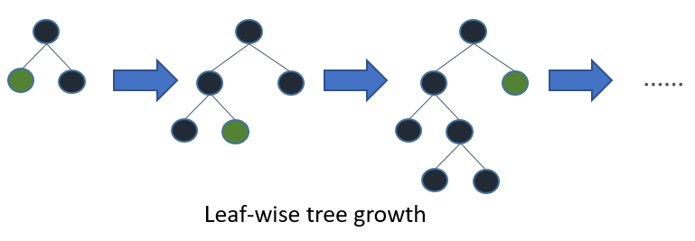
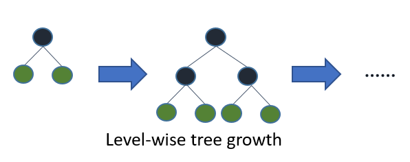
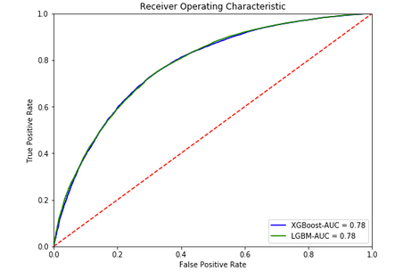

# DonorsChoose.org Data Mining Project

An in-depth data analysis and machine learning project focused on DonorsChoose.org data, developed by Anis T.

## Overview

This project focuses on understanding donation data through comprehensive data analysis, feature engineering, and machine learning prediction models. Our goal was to both analyze the data through visualization and develop effective prediction algorithms.

## Table of Contents

1. [Data Description](#data-description)
2. [Dataset Creation](#dataset-creation)
3. [Data Visualization](#data-visualization)
4. [Feature Engineering](#feature-engineering)
5. [Variable Relationships](#variable-relationships)
6. [Machine Learning Implementation](#machine-learning-implementation)

## Data Description

The initial phase involved analyzing observation counts in test and training bases, along with preliminary data type analysis and available information review. This included analyzing the 'resources' database and planning its integration into the final database.

## Dataset Creation

The workflow included:
- Adding an `is_train` attribute to distinguish between test and training data
- Merging databases to create a unified working dataset
- Conducting preliminary analysis on the combined dataset

## Data Visualization

Key analysis points included:

- Teacher proposal patterns
- Average proposals per teacher
- Previous proposal averages
- Geographic distribution of projects
- Temporal analysis of project proposals (Year, month, weekday)
- Class-wise proposal distribution
- Project category analysis

Text data analysis focused on:
- Common project title words
- Frequently requested resources
- Class characteristics
- Student demographics

## Feature Engineering

### Text Engineering

Important dates:
- Before May 17, 2016: 4 essay fields
- After May 17, 2016: 2 essay fields

Text processing included:
- Tokenization
- Classic preprocessing (lowercase conversion, etc.)
- Stopword removal
- Lemmatization
- Implementation of TfidfVectorizer, CountVectorizer, and DictVectorizer

### Date Features

Created from `project_submitted_datetime`:
- Year of Submission
- Month of Submission (1-12)
- Week Day of Submission (1-7)
- Hour of Submission (0-23)
- Day of Submission

## Variable Relationships

Analysis included:
- Project approval rates (85% approval rate)
- Temporal approval patterns
- Geographic distribution analysis
- Teacher prefix correlation
- Gender-based analysis
- Project pricing analysis by class and category

## Machine Learning Implementation

### Algorithms Used

1. **Light GBM**
   - Leaf-based tree growth
   - Faster processing
   - Configurable parameters for optimization

2. **XGBoost**
   - Level-wise tree growth
   - High performance on structured data
   - Extensive parameter tuning options

3. **XGBoost VS Light GBM**

And now :

Leaf-wise splits lead to increased complexity and may result in overfitting. This can be mitigated by specifying a different parameter, max_depth, which determines the depth at which splitting will occur.

### Results

The ROC curve is used to evaluate the performance of a predictive model.
It helps us determine whether the model is overall significant by addressing the following questions:

Does my model truly reflect causality?
What will be its reliability (associated costs) when I use it?
Which model among several candidates will perform best given my objectives?
To gain insights into deployment performance or to compare multiple candidate models, the ROC curve is essential to validate the work done.

The following figure shows the results obtained and helps evaluate the relevance and quality of the implemented learning model.

Both algorithms achieved a 78% ROC curve score, indicating satisfactory model performance. Performance was optimized through:
- ROC curve area maximization
- Hyperparameter tuning
- Feature selection refinement
- Data preprocessing improvements
- Model strategy optimization
